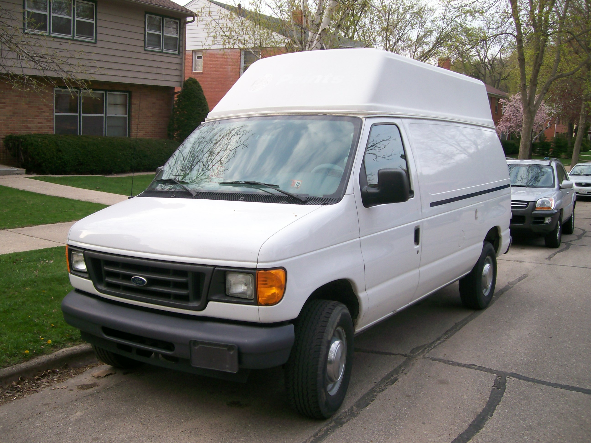

The first step in the process is buying a van, and after a year of looking, planning, and hem-hawing, I did it. I found a 2006 Ford e350 on ebay for $5000 so I scooped it up.

The first step in the process is buying a van, and after a year of looking, planning, and hem-hawing, I did it.

I found a 2006 Ford e350 on ebay for $5000 so I scooped it up.

I was leaning towards the sprinter chassis for it's integrated high top and superior gas mileage, but when I worked out the cost savings for the gas mileage difference it didn't make up for how much more expensive a sprinter would have been.

I figured that with an average of 300 miles traveled per week and gas prices of $3.25, I'd only be saving $1230 a year driving the sprinter. And to get a sprinter I'd be paying probably $10,000 total, it would have more miles on it, and the parts and repairs would be more expensive.

So I'm happy with the decision and feel after driving this for a few days and working on the interior a bit that the e350 will be a fine chassis to build on.