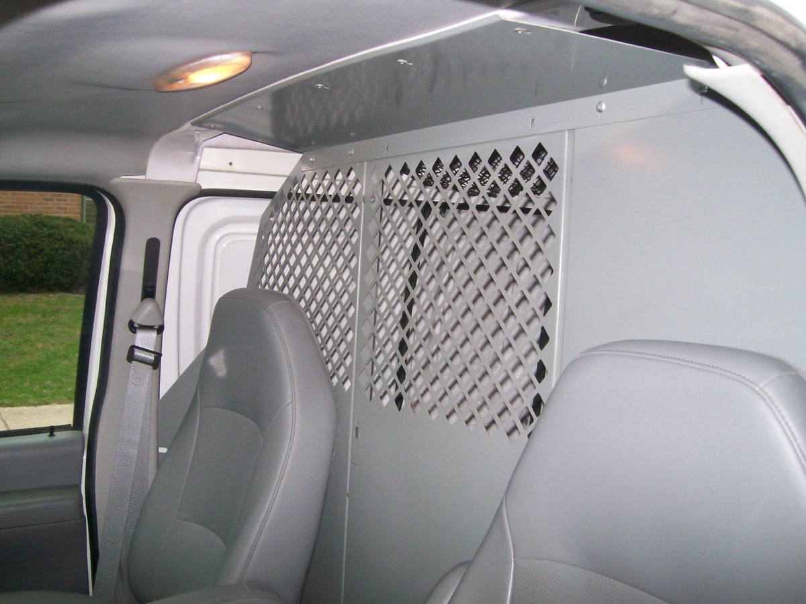

The van was previously used as a painter's work truck, so there was a fair bit to clean out.

First, had to remove the old cargo management system and plywood floor.

Then I took out this divider/security wall.

Everything was installed with rivets, which were kind of pain to get out. I had to drill them out. THen I removed the remnants with a wire brush and flap-sanding disc grinder. I used this on rust as well.

Any bare metal I treated with Rustoleum's White Clean Metal Primer.
