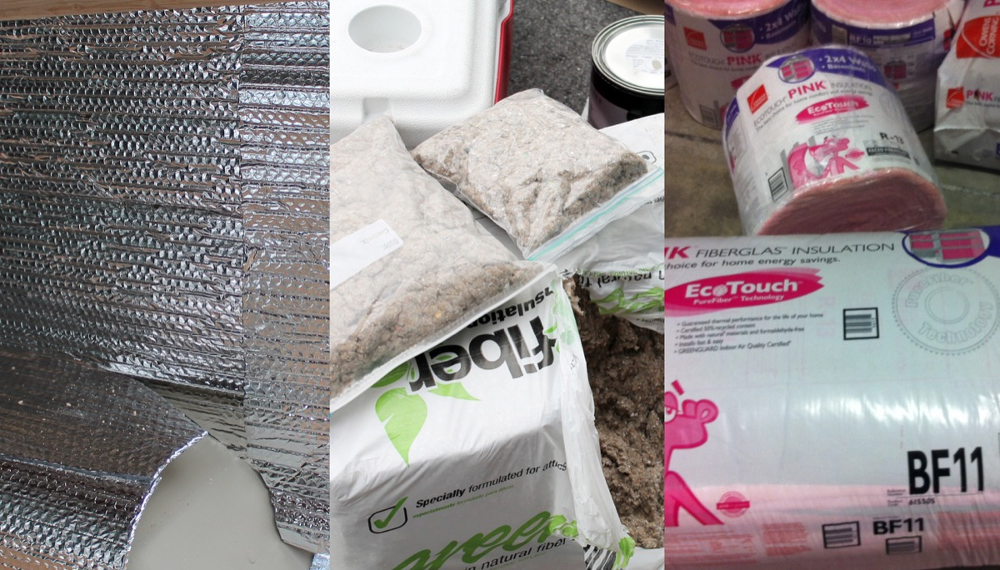

I am considering a few things for my insulation:
Staying cool in the summer, staying warm on chilly nights, not taking away too much interior space, and not offgassing dangerous chemicals.

It turns out to be hard to find safety data for insulation when used in a very enclosed space like a van.

After doing some reading, it seems like three layers will be practical, effective, and not too expensive to do.

First will be a paint mixed with ceramic beads. A brand name version of this is called Lizard Skin, and it's supposed to have good insulating properties and does not take up any space inside the van, which is great. This should deaden sound a little bit, keep heat out in the summer, and keep heat in in the winter.

The second layer is a foil face bubble wrap, name brand Reflectix. This is supposed to be great for keeping heat out in the summer.

The final layer I haven't decided on. I think a Jute would be safest in terms of offgassing, but I haven't ruled out a polystyrene wrapped fiberglass.

Sources for Van Insulation Info:  
<http://camperize.com/ceramic-paint-microbeads.html>  
[http://www.hotrodders.com/forum/alternative-lizard-skin-103610.html  
<http://www.camperize.com/bubble.html>](http://www.camperize.com/bubble.html)
