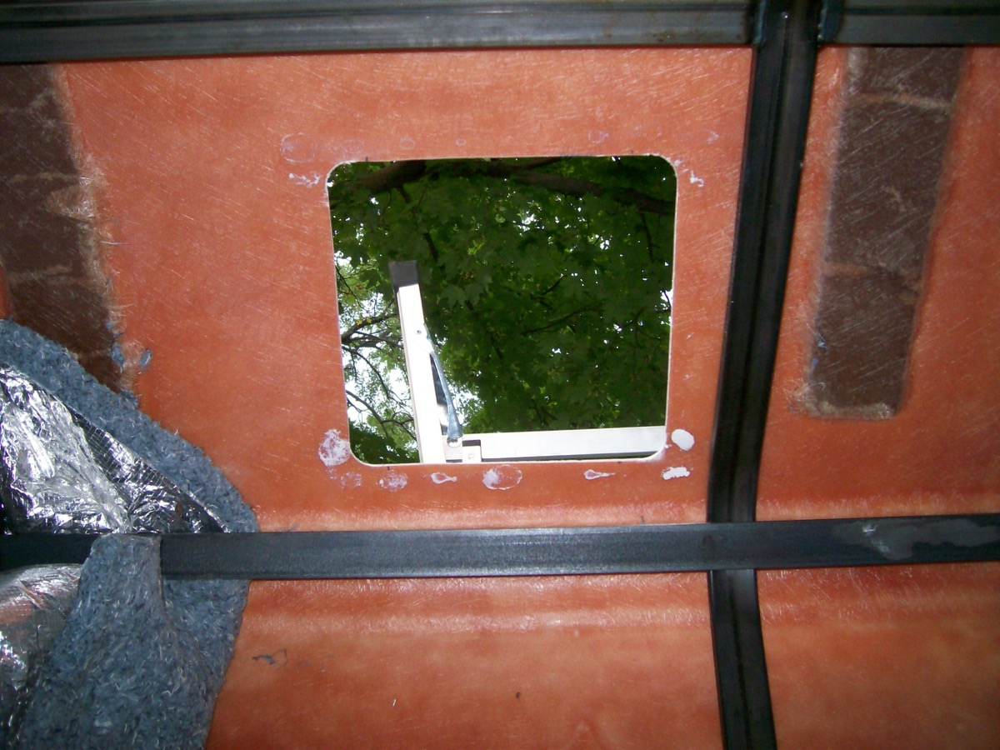

I finally cut into the roof today...

## The Plan

I finally cut into the roof today. I threw all my stuff up on the high top: foam padding, drill, marker, mask, vent trim to outline the shape... Then I climbed up and got nervous. How do I know where in the interior this is going to come down?

So I changed plans. I got inside the van, marked out where I was going to put the van, got the drill all set up, took a deep breath, and started drilling. Hot plastic flying everywhere (it was a mess), and finally a hole punches through. It's dark. Not bright, like the sky. I get a light and take a look.

6 inches of air space between me and another fiberglass panel. I knew the roof was some kind of sandwich construction but I thought they'd be more efficient about it. I can't line up two holes with 6" of space between them. So i cut a bigger hole. Now I can see what's going on. And it sucks. There's insulation, wiring for the roof lights, steel reinforcement (!). Not making my vent installation job easy. So I tape up the hole I cut out and quit for the day.

Next day, I come back and I decide I'm going to see if i can just rip out the inner roof.

So I do.

That... was dramatic. Made a big impact. I think I'll be able to make better use of space now (the old inner roof wasted tons of space above the driver's compartment), but it's a total mess. Foil face jute, steel crossmembers everywhere...

I guess I'm finishing the roof now.

Here's the new plan:

  1. Install roof vents (since the roof is curved this will involve some kind of fabrication [bondo?])
  2. Paint interior w/ insulative paint
  3. Install side window
  4. Frame interior (small wood braces to tack paneling to and give the insulation some room
  5. Insulate (foil faced jute?)
  6. Panel the interior (I found a nice looking bamboo paneling, and I'm thinking thin carpet for the roof)
  7. Build/Install Bed and cabinet system out of pipe or t-slotted aluminum extrusion
  
## The Execution

This is a step by step description of installing aftermarket/eBay roof vents in a camper van with a fiberglass high top roof. The vents are nice because heat rises and this way you can let it out. I learned most of these methods from different internet sources (linked at the bottom), but there was no good central place with lots of pictures, so I thought I'd make one. Hope this helps, feel free to leave questions in the comments.

 

### Step 1: Make a Template

I started by making a template out of cardboard that matched the size of the hole I wanted to cut in the roof. The best way I found was to trace the plastic trim piece (the part that actually drops through the roof), then cut out the result. I was going to skip making templates but I'm so glad I didn't. It made the process much easier.

 

### Step 2: Mark the Cut on the Inside of the Roof

Just trace around the template

 

### Step 3: Build Wooden Frames

The inner dimension of the frame should match the size of the hole you'll cut. The wood frames give the vent something to screw in to--the fiberglass isn't really enough.

 

### Step 4: Attach the Wooden Frames to the Roof

This was actually pretty futile. I used a liquid nails knock off and didn't want it to offgas too much so I used it lightly. It was useful to make sure the fit was right, but these kept falling off when the drilling and cutting started. Oh--it was also useful because I cut the round corners with a doorknob hole drillbit, so it was easy to mark the right center starting point with these frames in place.  

 

### Step 5: Make the First Cut

With the wood frames in place, mark all the center points for your drilling. I used a drill bit meant for doing doorknobs, and it worked great. Just get the outside flush with both corners, and drill a little intil the center bites in enough to leave a mark. Do this for all four corners. Then start really cutting on whatever corner you think is the ugliest. The fiberglass is a mess, so wear clothes you'll throw away and a dust mask. The wood frames started falling apart at this point, but it was OK since all the corner locations were marked.

 

### Step 6: Finish the Corner Cuts

Finish the other three corner cuts (hopefully you've marked them accurately). Then draw straight lines on the outside of the roof between each corner. This will help you keep the jigsaw straight. You could try and do the straight cuts from inside, but I didn't want to try doing that upside-down.

 

### Step 7: Make the Straight Cuts

Using a jigsaw and a metal cutting blade (what the Home Depot guy recommended for fiberglass), make straight cuts between the corner holes. The construction of the vents gives you plenty of wiggle room, but I still tried to keep the cuts as straight as I could.

 

### Step 8: Test Fit Your Cut

This is the moment of truth. Hope you cut the hole accurtely and drop the vent in from the top. Also, a major concern for me was the slope of the roof. I picked the flattest place I could to install the vent, but as you can see in the picture, there's still a big difference in the gap's size as the slope of the roof changes. Because the gap difference was large, I agonized for a while over whether I wanted to use bondo to flatten the mating surface or not. I finally decided to leave it as is and seal it directly to the roof.

 

### Step 9: Use Butyl Tape to Seal the Vent

This stuff is wonderful, easy to work with, and forgiving. It never hardens, and waterproofs completely. Love it for this purpose. Grab a roll of Butyl tape from Amazon or an RV supply store. Then just peel off the adhesive and stick it to the vent. (it'll be stringy like chewed gum if it's hot out, so leave the roll in the fridge for an hour or so if it's being a pain). I used extra layers of Butyl where the vent had a larger gap to accomodate the roof's slope. Just tape all four sides and then smush the vent down into place. If the fit looks alright, start to screw the vent down, right through the Butyl. Once this is done, you should have squeezed out lots of extra Butyl tape and have a nice fit on your roof vent. (the picture shows this on the 2nd vent. I installed 2, don't let that confuse you--same process)

Butyl Tape Source:  
[http://www.amazon.com/United-States-R-011B-Butyl-Seal/dp/B000BQUPYE/ref=pd_cp...](http://www.amazon.com/United-States-R-011B-Butyl-Seal/dp/B000BQUPYE/ref=pd_cp_hi_1)

 

### Step 10: Clean Up the Excess Butyl

Use a plastic knife with the seratted edge filed off to clean up the excess butyl tape and give your install a nice smooth look. (thanks for the tip, random internet stranger!). The plastic knife does the job pretty well. I'm sure there's a fancier tool available if you like being fancy. Maybe you'll get lucky and it'll come with a free martini glass.

 

### Step 11: Seal the Screw Holes

(requisite screw holes giggity) Just go over the top of the screw holes with a little bit of non-silicone based sealant. I used Dyco C-10 Flow Seal. Some internet person (in the sources below) said it was great, and I found it to work very well, too. You can buy it here:

[http://www.amazon.com/White-C-10-Flow-Leveling-Caulk/dp/B0009N4J6E/ref=sr_1_1...](http://www.amazon.com/White-C-10-Flow-Leveling-Caulk/dp/B0009N4J6E/ref=sr_1_1?ie=UTF8&s=hi&qid=1281829420&sr=1-1)

I'm not sure this step is even necessary, since the screws go in to Butyl anyway, but if the internet tells me to do something, it's hard to resist. Anyway, it has worked well and I'd do it again. (oh boy, another giggity opportunity)

 

### Appendix A: The Final Appearance from the Inside

I suppose "final" is relative--I haven't paneled or otherwised finished the interior. But this is what it looks like.

 

### Appendix B: Wrap Up

So that's all there was to it. Really not as bad as I was expecting. Overall, I'd just suggest measuring very carefully, cutting slowly, and making sure you have the right materials prepared before you cut the first hole. I was very cautious about cutting into the roof of my van, so I read _a lot_ before starting. The best sources I listed below. I hope this helps someone else.

 

Sources:

<http://rv-roadtrips.thefuntimesguide.com/2008/10/rv_roof_vent.php>  
<http://rvtravel.com/blog/lowtech/2007/04/its-putty-tape-time.html>  
[http://www.sunlineclub.com/forums/f71/replacing-roof-vents-101-with-pics-8922...](http://www.sunlineclub.com/forums/f71/replacing-roof-vents-101-with-pics-8922.html)  
[http://www.fiberglassrv.com/forums/f55/butyl-tape-silicone-and-sealing-24715....](http://www.fiberglassrv.com/forums/f55/butyl-tape-silicone-and-sealing-24715.html)  
<http://www.plustape.com/BK/index.htm>  
<http://www.youtube.com/watch?v=YMru54UY6Aw?wmode=transparent>

### Appendix C: 2 Years Later
It's been 2 years since I've installed these. They haven't leaked a bit and seem to be holding up great. This method worked great, highly recommended.

