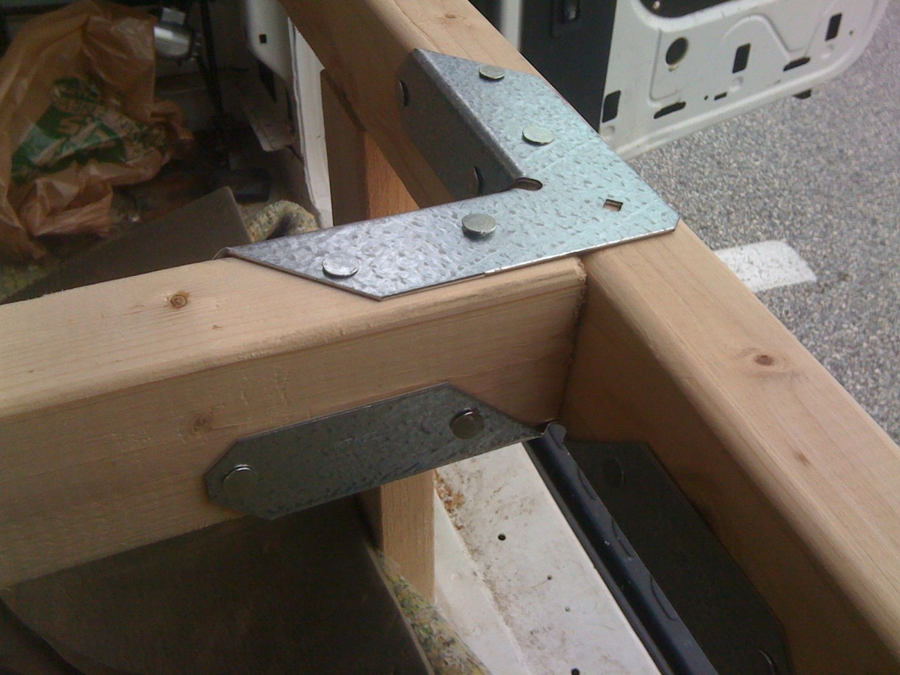

In preparation for a move from PA to FL, I need both a sleeping area and some storage for the things I'm moving in the van.

I have some ambitious plans for building out the interior. This planning amounts to fancy procrastination and it has delayed the building of any kind of bed. I have been rolling around with a queen size mattress on the floor of the van for the past year or so. It's effective and comfortable, but a huge waste of space.

I am about to relocate from [Philadelphia to Panama City](http://maps.google.com/maps?q=philadelphia+pa+to+panama+city+fl), so I need both a sleeping area and some storage for the things I'm moving in the van.

My solution was a quick and easy wooden bedframe designed specifically to be an inch taller than the gray storage bins I buy at Walmart.

Cost for all supplies was $74.57. Time invested was something like 5 hours. It could have been done cheaper using wood braces and lots of 45 degree mitre cuts, but I had already packed my power tools so I was working with a hand saw. The metal joining brackets I used made this much easier to build, though more expensive.

Steps

1: Sketch out a plan. This was done at Home Depot in the lumber section.

2: Build Rectangle. This could be done outside the van. If I had put legs on it, it wouldn't have fit through the door, so I had to build the rest inside the van.

3: Build the Rest. The metal brackets made this an easy build--it was almost as easy as building with lego.

4: Result

