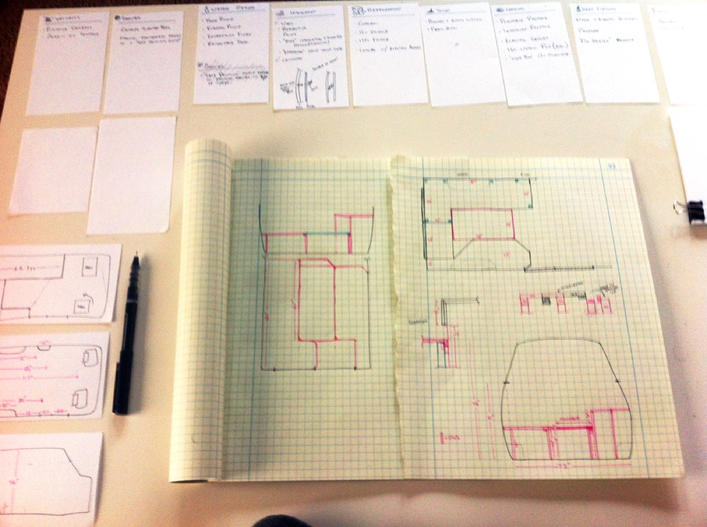
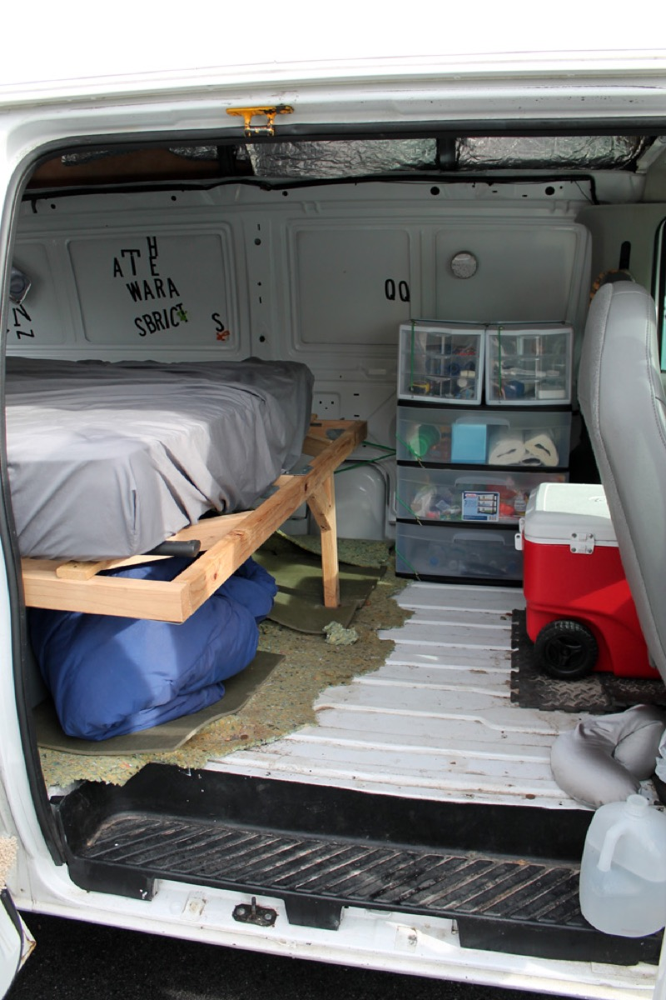
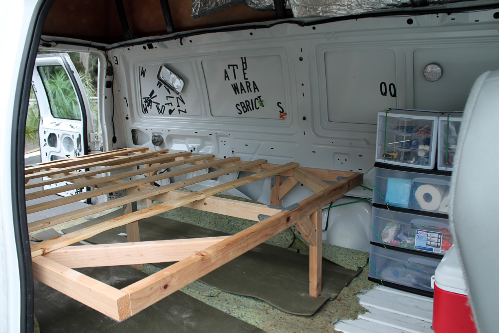
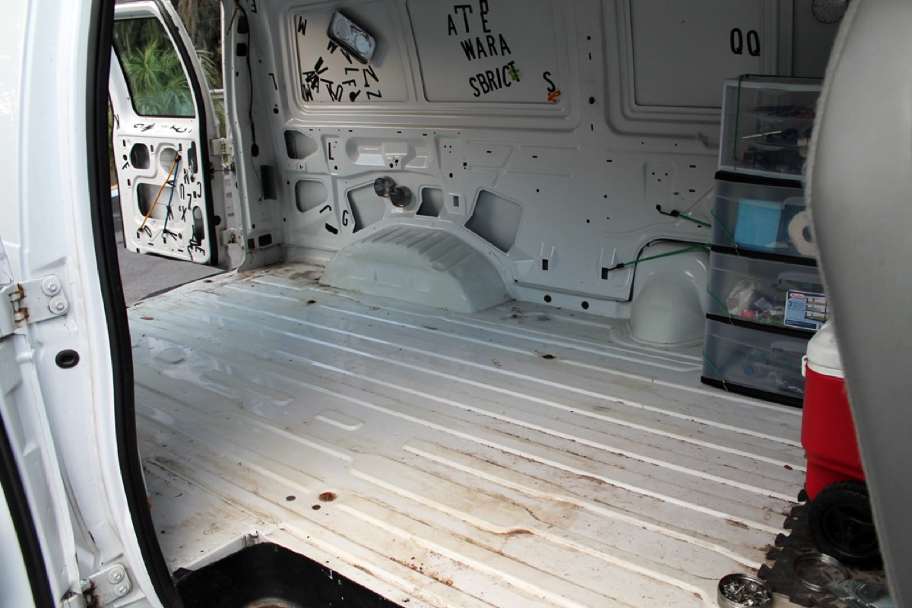
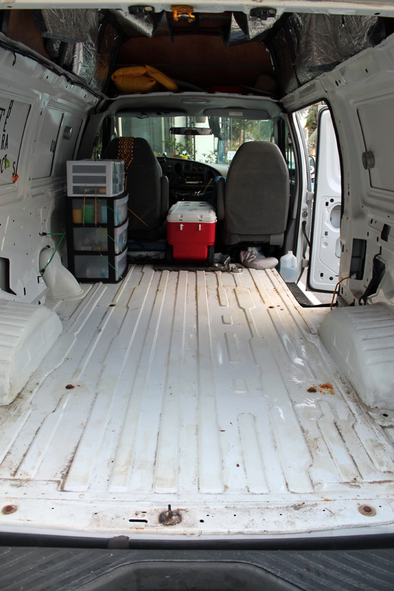
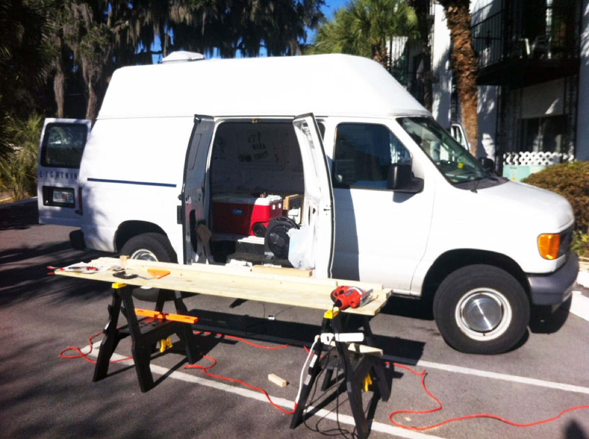
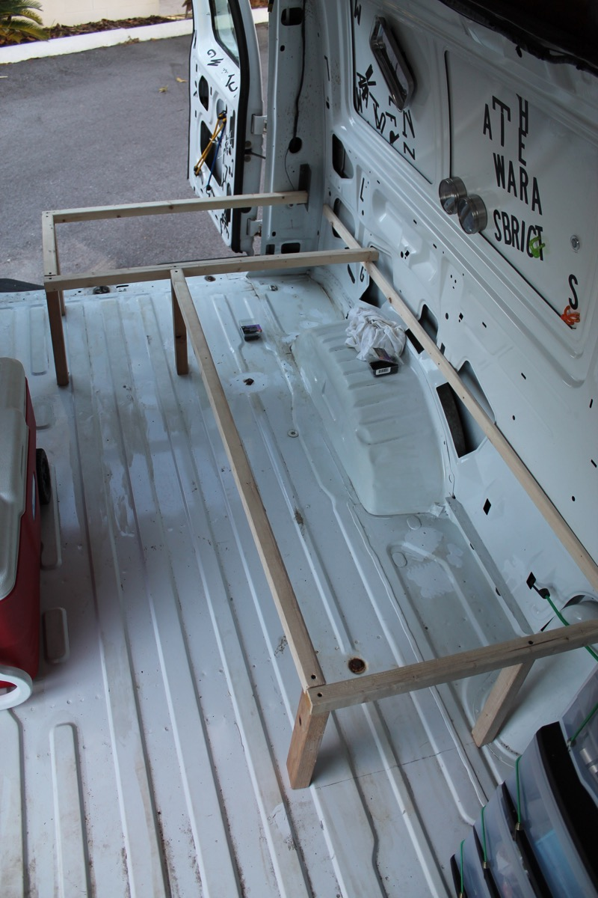
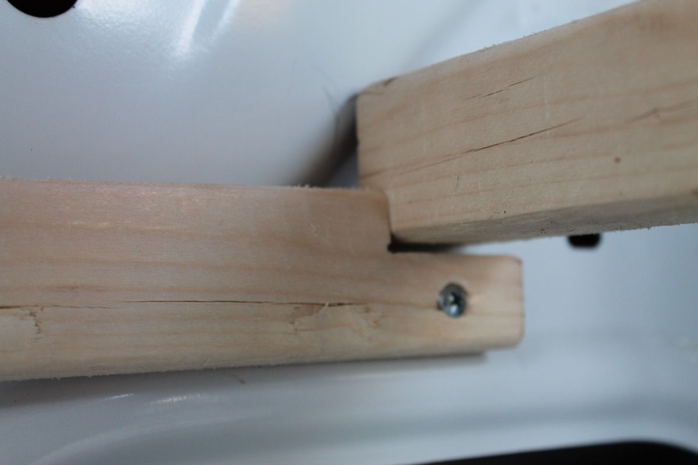
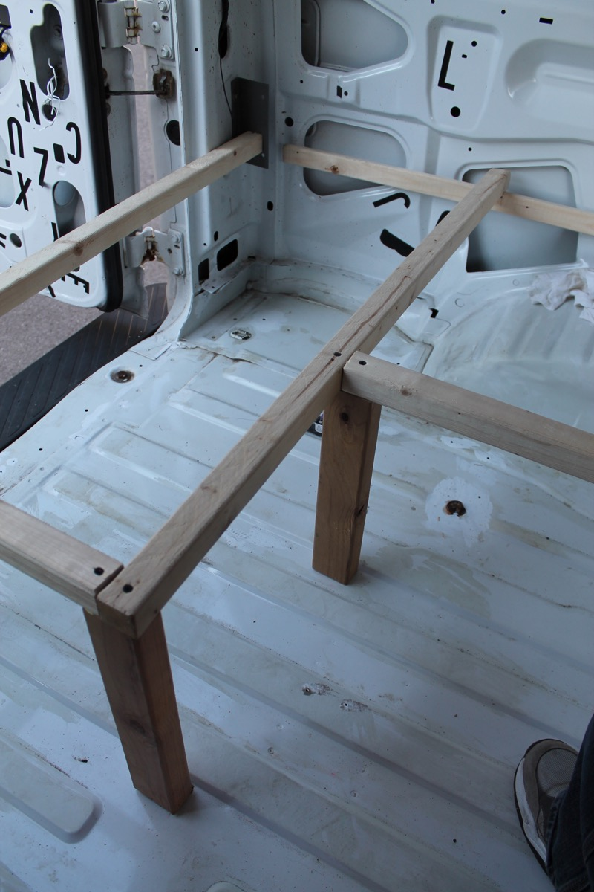
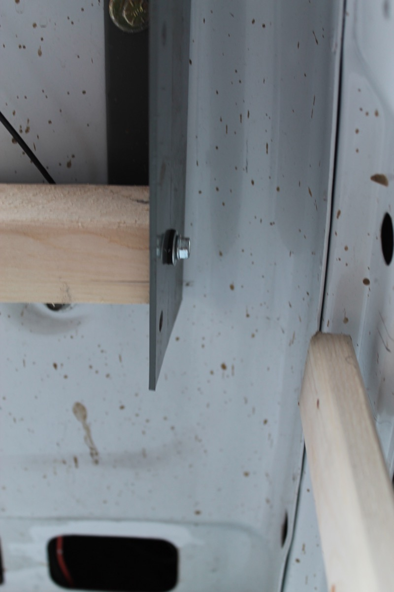

I did a flurry of work on the van in preparation for a 3 week cross-country road trip. It started with a lot of drawing, as many things do if you're trying to avoid real work, or if you hire a design school graduate. Graph paper was the best medium for this kind of drawing and I'd suggest it for you and your children's children.

After drawing, visiting home improvement stores, drawing some more, and settling on a plan, I had to look at the current state of the van and empty it out.

Cleaning House

The existing bed was not attached to the van chassis and was a solid piece. It didn't do the cool couch-to-bed folding that I wanted out for a real professional rubbertramping bedcouch. It was also extremely... dynamic... in the event of a rapid, collision-style stop.

Emptied Out:

 

Initial Framing

After clearing out the van, I did some inital framing of the furniture.

I set up an outdoor workshop:

Then I framed the L shape for the convertible bed/couch. I decided to frame in 2x2s, which was a good decision I think. 2x4s then became a good size for vertical supports. Building the furniture frame at this point was mostly a waste of time since the floor and wall framing should happen first, but I didn't know that when I started. It was nice to see the drawing turn into something real, but I found it got in the way while I was working on the floor and walls later. The mounting points and style had to change later as the floor added height and the wall framing suggested some different ideas for attaching to the wall.

