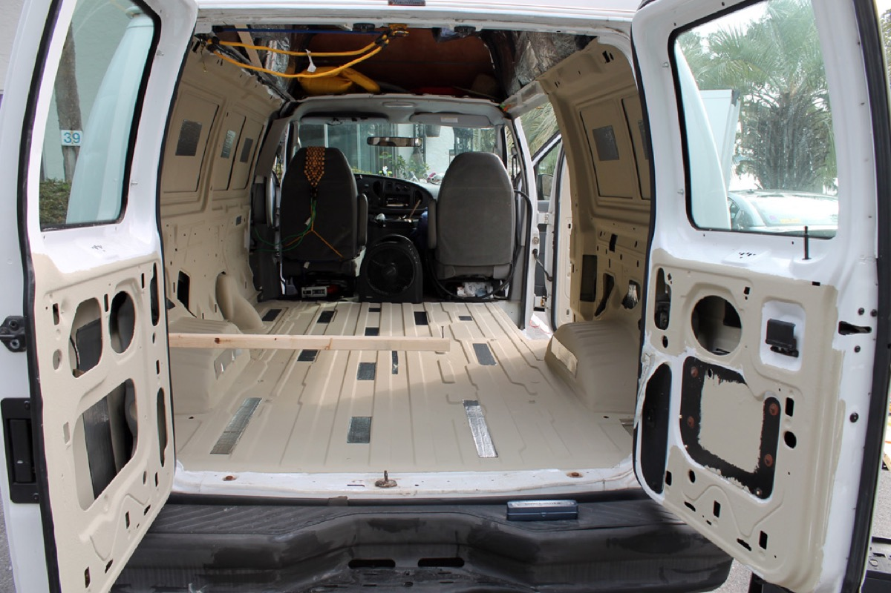

Prepared a cargo van for heat/sound proofing and rust prevention.

To keep external sound under control, it's a good idea to paint the interior of the van with a heat/sound proof coating, and add a few pieces of sound deadening material.

Interior Cleaning

I used a product called TSP, Trisodium Phosphate, to prepare the van for painting. It seems to be what people recommend. I think it worked ok, but the paint does still scrape off easily. Could be that I used latex paint, but I do wish I'd rough sanded the walls a bit. I think it'll still stick ok, since the paint will be protected behind layers of insulation and paneling later. This stuff is pretty scary looking, so I wore gloves and a mask and stuff.

Heat & Sound Blocking Paint

Lizardskin is an expensive product that hot rod builders use to deaden sound and block some heat transfer. Folks online say that you can make your own substitute by mixing ceramic microbeads with paint. I bought my paint from the Wal-mart mismade color section my beads from Wicks Aircraft Supply. Most folks seem to recommend a 1 gallon of paint to 1lb of microbeads ratio. That's what I did. If the TSP was scary, microbeads were from a vampire laser dinosaur horror film. The stuff looks like a liquid and a powder at once. I bought the full Darth Vader mask for this stuff. Takes forever to mix up. I mixed it and painted it all over the inside.

<http://www.camperize.com/ceramic-paint-microbeads.html>

<http://www.collegeparktuning.com/showthread.php?t=2712>

<http://www.hotrodders.com/forum/alternative-lizard-skin-103610-13.html>

Sound Deadening Tiles

To begin to deaden sound, one needs to stop the metal from vibrating. Dinamat is the brand name of this material. Folks seem to say that roofing products more or less do the same thing. They're asphalt based and outgas nasty petroleum based stuff, so I limited my use of them.

Based on advice from the source below, I believe that I only need about 25% coverage for these sound deadening tiles to be effective. (judging now, with everything else in place, sound suppression seems very good)

I tried to put them inside the doors and on the largest flat pieces of sheet metal.

<http://www.sounddeadenershowdown.com/>