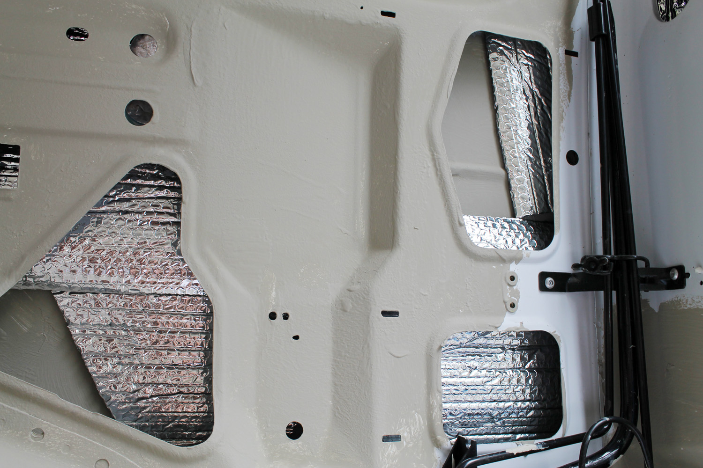
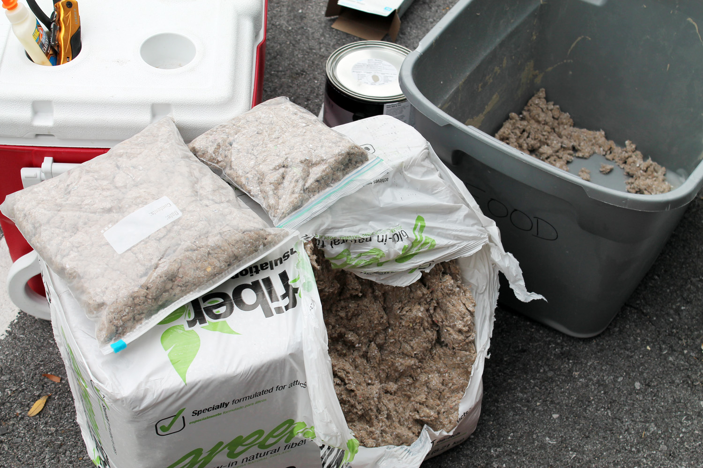
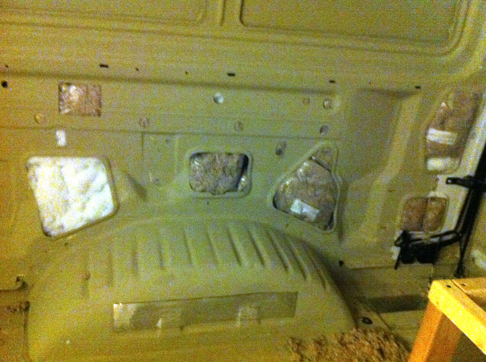
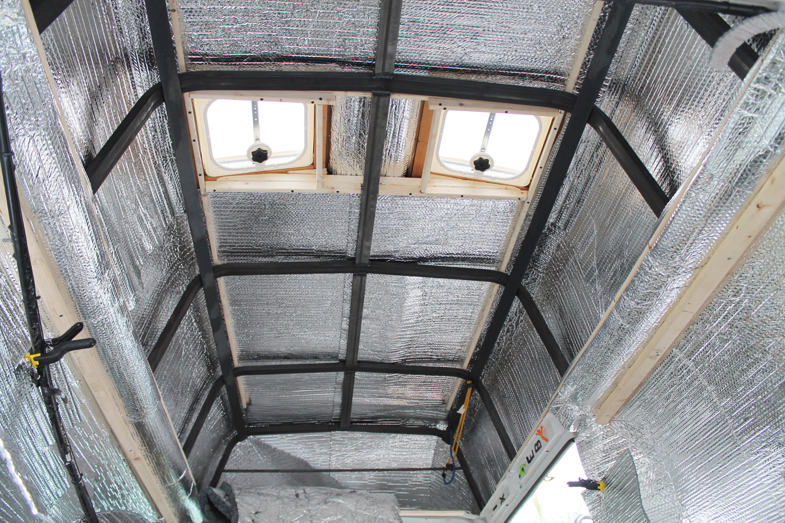
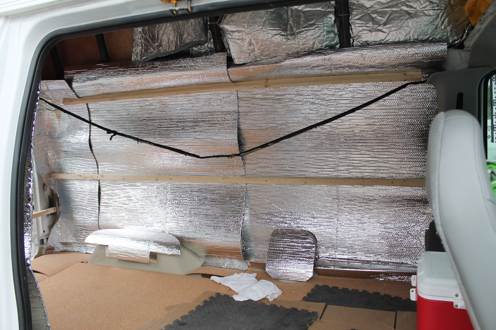
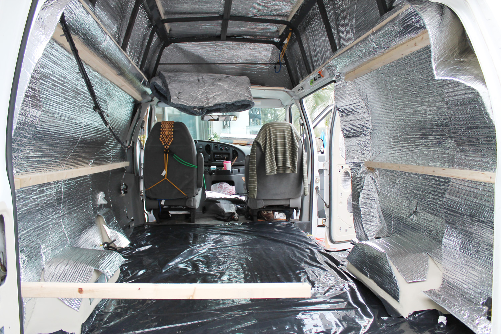
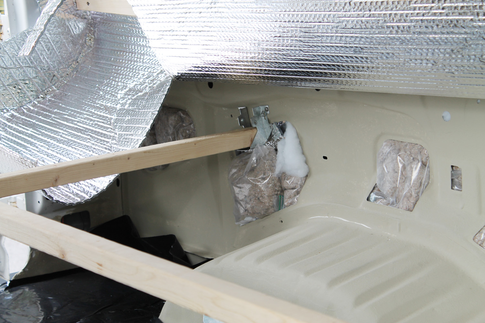
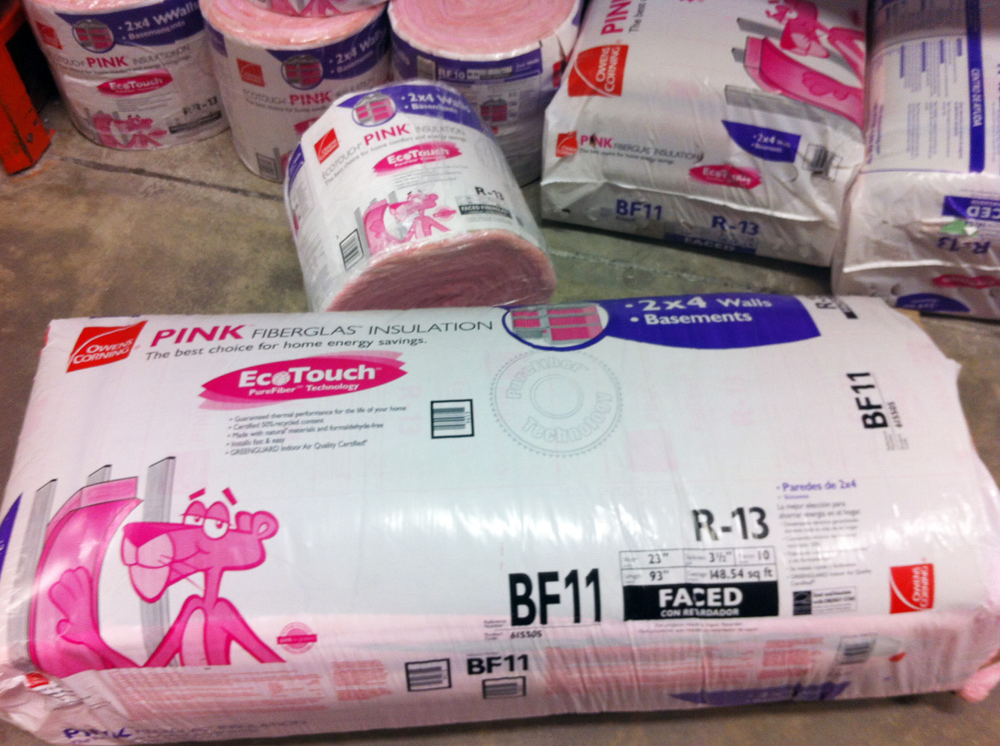
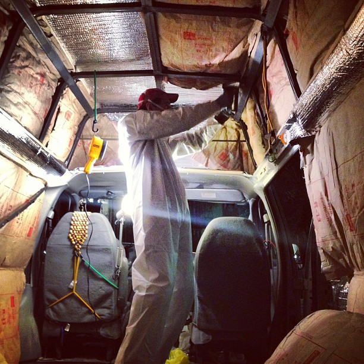
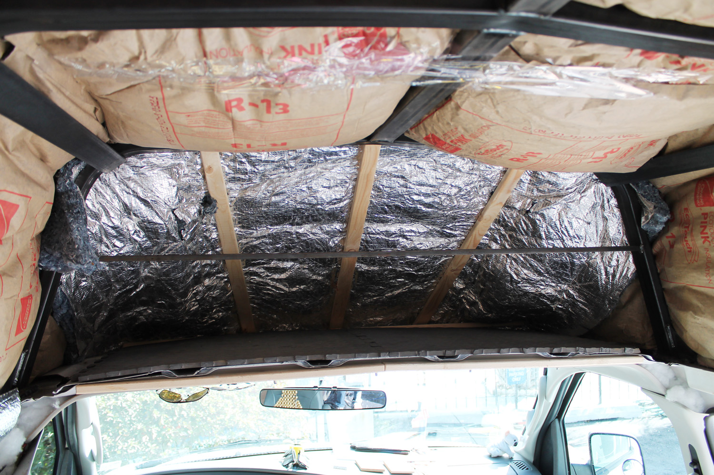

Insulation keeps your van cool in the summer and warm in the winter. Insulating a van interior means carefully considering balancing aspects like interior space, moisture retention, toxic chemicals, and insulative properties.

The walls were framed horizontally at 23" apart so that insulation could run horizontally and minimal framing would be needed. I did an outside layer of Reflectix, held in place with 2x2 framing studs, and stapled the insulation to those.

### Steps:

  1. Stuff Reflectix and loose fill insulation into gaps and holes
  2. Dry fit reflectix
  3. Dry fit framing
  4. Screw framing into van wall through the Reflectix
  5. Add needed wall anchors
  6. Install insulation

### Stuff Reflectix & Loose-fill Insulation into Gaps

My van was full of holes in the walls, the doors, everywhere. It is very like political arguments in this way. I dry fit Reflectix into as many of the spaces as I could. Reflectix bounces radiant heat out, so it's the first layer. After that I stuffed in loose fill insulation. I used cellulose, which is natural and has no nasty nasty chemicals, but I got nervous about it retaining moisture so I bagged it in freezer bags first and shoved those into as many gaps as I could. Remaining holes I stuffed with Polyester fiberfill which should not retain moisture as much and could get into tiny gaps.

Get reflectix in as many gaps as you can

Cellulose is toxin-free and is a fair insulator. Retains moisture though.

Van walls stuffed with cellulose in freezer backs and polyester stuffing.

### Attach Framing and Reflectix

I cut Reflectix to fit the whole van and fit it in place using clamps, and cut the framing I would need. Then I attached the framing to the van walls using self tapping stainless steel screws, which actually don't work well through wood--you still have to two step it, since it's trying to pull through the wood while it's tapping the hole for the sheet metal.

I framed around the skylights at this point, too, anticipating where the insulation would go.

What I really liked about this installation method is the reflectix was all attached without any adhesives or glues, so there's no possiblity of toxic outgassing.

 

### Wall Anchors

I attached some anchors to the walls to help stabilize the furniture. I think I'll want more in the future but I added the ones I knew about. Getting them behind the reflectix wasn't tough--just cut notches where the attachment points need to get.

### Install Insulation

I thought and read a lot about insulation. There are many options:

  * Fiberglass (itchy to install, usually bound with Formaldehyde)
  * Denim (moisture retaining, not locally available)
  * Cellulose (loose fill likely to settle)
  * Kingspan rigid foam boards (shows toxic outgassing for years)

I ultimately went with a new fiberglass type called 'Ecotouch' which isn't bound with Formaldehyde because it was locally available, had good r-value, wouldn't retain moisture, and was non-toxic as best as I could tell.

Still itchy to install though. We suited up and stapled insulation against the framing and wedged it into the remaining door panels.

I had some denim available and used it in the above-cabin compartment where fiberglass was too thick. Most of the roof insulation was tension fit using 2x1s wedged against the existing steel framing.
