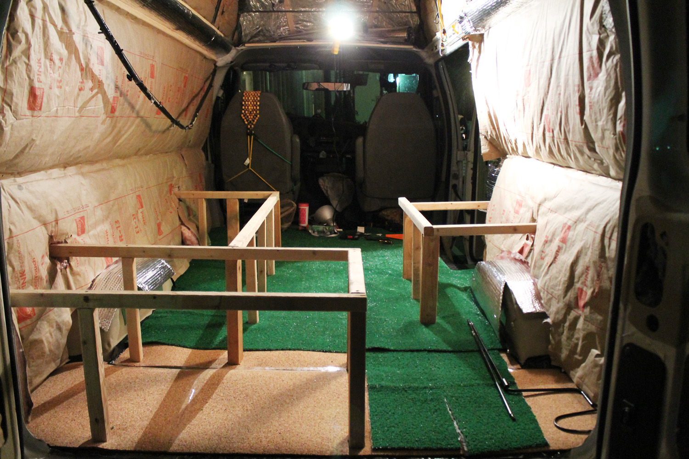
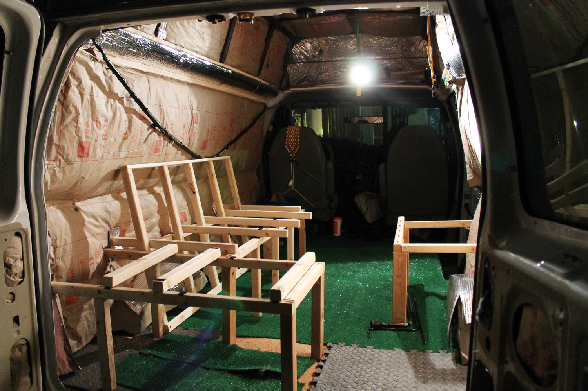
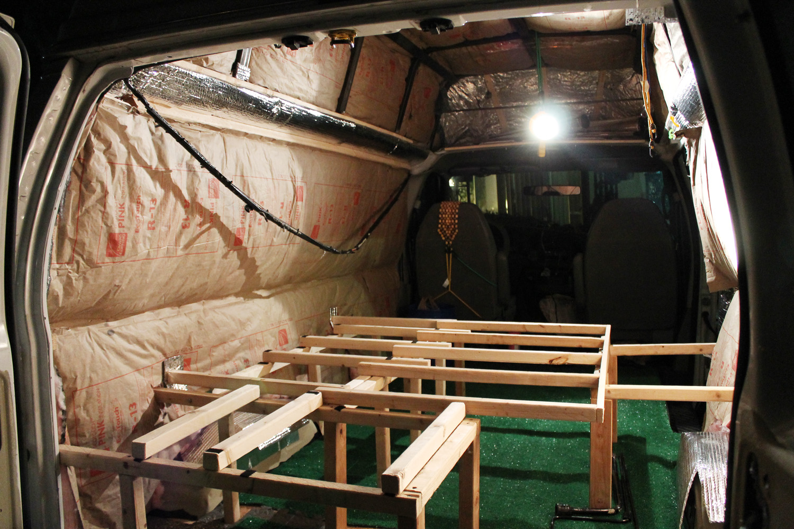
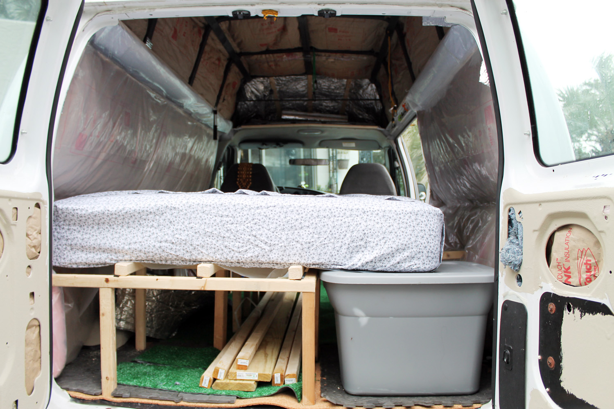

I wanted to build a bed that can fold into a couch.

I wanted to build a bed that can fold into a couch.

The couch is designed to be L-shaped, with a folding section that extends to make a bed.

The basic frame was built using 2x2s and 2x4s. The vertical supports were bolted thrrough the floor of the van using lag bolts from underneath and huge fender washers.

The wall attachments use galvanized lumber hangers.

The joists for the bed are velcro attached 2x2s. This was an easy way to make them removable, but is not very stable. It worked for our 3 week trip, but I'd like to improve it.

The couch back interlocks with the other 2x2s and so folds in an unconventional way. I think it will work, but I can't be sure until I get foam in place for the bed and matress.

We used it as a matress platform and it's great for that, but I'm not sure how convertabile it is at this point.

### Update
The folding system didn't work well. I've removed the folding portion. The point where the extended platform meets the far support gets a lot of stress, and the manner of folding means cargo can't really be under the couch. I'm working on a different way to do this.
