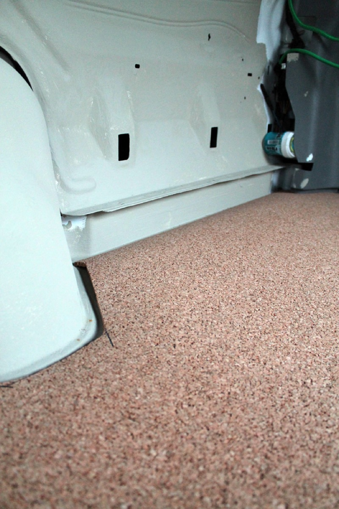

Converting a van to an RV requires a good moisture barrier to prevent rust and a good underlayment to insulate, reduce noise, and prevent vibration.

The floor of the ford e350 is grooved, to provide stuctural stability I think, or to help match with a future installed disco ball. The floor I ultimately want to put in is hardwood, so I needed to install an underlayment and moisture barrier.

The order of layers is:

* Van floor  
* Something to fill the grooves  
* Cut through holes  
* Moisture barrier  
* Cork Underlayment

### Filling the Grooves

Grooves were filled with strips of Reflectix because of the minor insulation benefit they'd provide and because they don't retain any moisture. They don't level out the grooves completely since they aren't very compression resistant but they're better than nothing.

Reflectix cuts easily with scissors and masochistically with a razor blade. You can see in the photos that the L shape frame would have been better if it were not in the way at this point.

### Cut through holes

I knew I needed to get holes through the bottom of the vehicle for a plumbing drain--not the usual way, but if I'm just draining rinse water, I don't see a problem. I cut a hole using a spade shaped hole cutting wood bit. This took forever to do, but the PVC fit was perfect. I hammered in facing pieces with a rubber mallet and secured with liquid nails for hold and butyl putty for waterproofing.

This fitting will later let me attach PVC plumbing to it so I can drain my sink outdoors when appropriate.

I want under-mounted leisure batteries, but I wasn't sure what through holes I needed for these so I'll have to lift up the floor to install these later.

  
### Moisture Barrier

Moisture barrier is some black plastic made for the purpose from a home supply store. Installed by laying it right over the Reflectix, cut to fit in the van, and secured around the edges with silicone.

Ignore the framing in these pictures and the Reflectix on the walls--that got in the way and should have been done after the whole floor was installed.

### Cork Underlayment

I used cork for underlayment, sound proofing, and some small amount of insulation because:

  1. Cork doesn't outgas chemicals like foam does
  2. It's easy to work with

You can cut cork with a razor blade. I just cut it and dry fit all the pieces. The temporary floor I have installed (not pictured), sits right over floating cork without any slipping problems, so I think the floating-fit is a fine installation technique here. The cork is pretty curled up so I tried to weight it down flat with wood scraps and heavy objects like cans of soup, art history books, and feather pillows.

