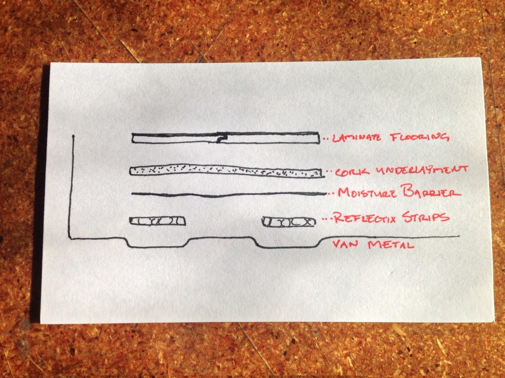
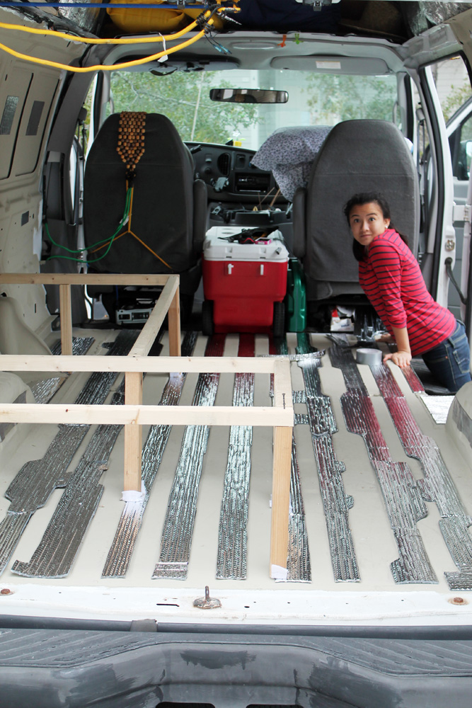
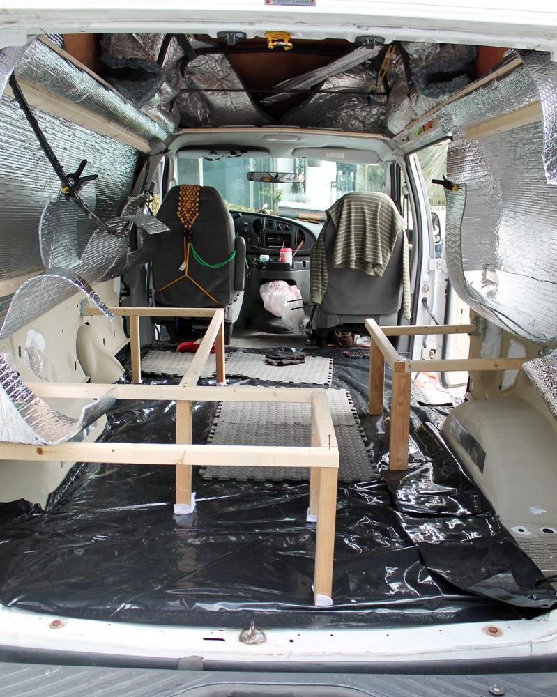
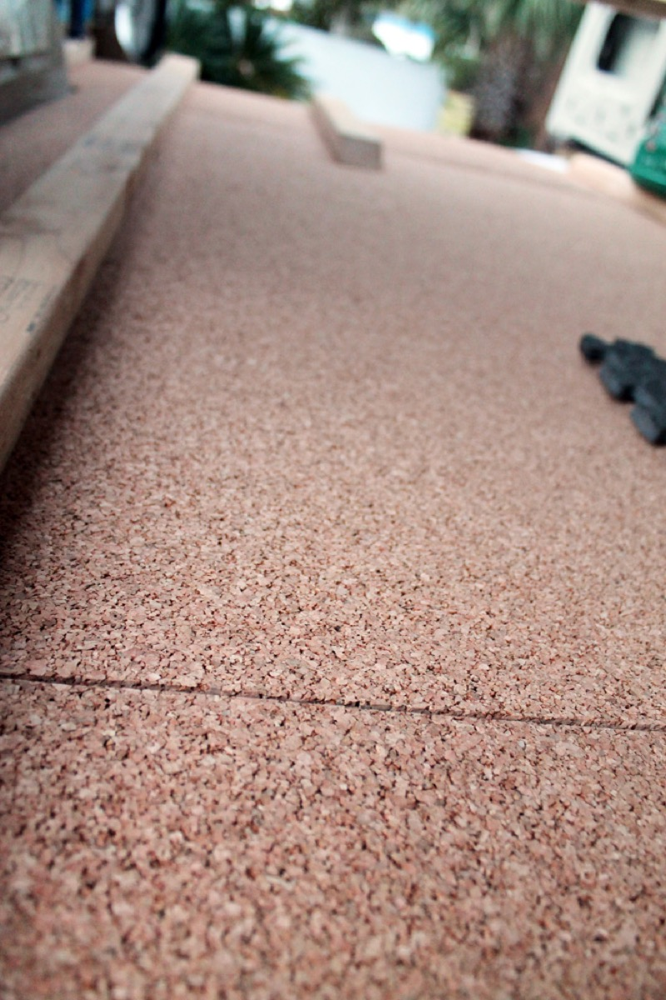
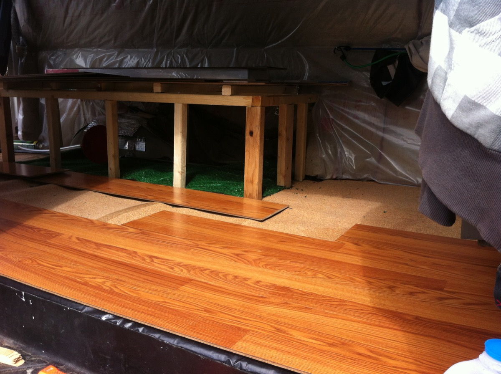

Installing flooring in a van is the first step (wish I'd known when I started :) to conversion to an RV. I chose laminate click flooring because it's easy to clean, durable, and I love a bright wood look.

I built this at TechShop in San Francisco. Living in the city I don't have room for tools and the wood shop there made cutting the flooring to size a piece of cake.

The Plan (Layers)
-----------------
* Click flooring   (Laminate/compressed wood)
* Underlayment     (1/4" Cork)
* Moisture Barrier (Plastic)
* Flattener        (Reflectix to fill ridges in floor)
* Bare, prepared van metal

Prepare Metal
-------------
Prepare the van interior by cleaning, sanding out any rust, and repaiting. You aren't going to see the actual van floor again (hopefully ever), so don't leave any rust around to melt your floor out from under you. I also chose to paint with a layer of sound dampening paint like Lizardskin but this is optional.

Fill Gaps to Level Floor
------------------------
The floor of most vans has 1/2-1/4" ridges that help make the floor more stable. I wanted to bring this up to a level height so that an installed floor would me more stable. Also, the more insulation the better :)

Reflectix is a good choice because it's made of plastic so it can't hold moisture or rot. It will provide a small amount of radiant heat insulation (good if you park over a hot parking lot).

To fill the gaps, I simply cut it into strips and taped it down. Having a buddy to help makes it go really fast.

Moisture Barrier
----------------
Because you're gonna put a floor down, and because all humans exude humidity, and especially because I spill things and make a mess, you need a moisture barrier. This keeps moisture off your van's metal floor.

Buy a cheap roll of the stuff at home depot. It's just heavy duty plastic. You attach it with silicone and keep a water tight seal away from your van's metal floor.

Pretty easy stuff there.

Underlayment
------------
Underlayment keeps your click flooring from scooting around too much, vibrating, and is your chance to insulte under the floor. You can get cheap felt stuff, but I suggest cork because it's all natural and provides great sound proofing and some insulative properties.

Cork is easy to cut with a sharp razor blade and doesn't need to get glued down or anything, so it's pretty easy to put in.

Click Flooring
--------------
Once all the prep layers are in, you can cut the floor to size and install it.

I suggest you start with the furthest back corner and build your way out. I made this more difficult on myself than needed by having an L shaped couch already attached to the floor. Don't do this to yourself unless you really like cutting small shapes into planks of your flooring.

The click flooring is pretty easy to install, just cut them to fit your space and press them into place. A rubber mallet helps a lot.

