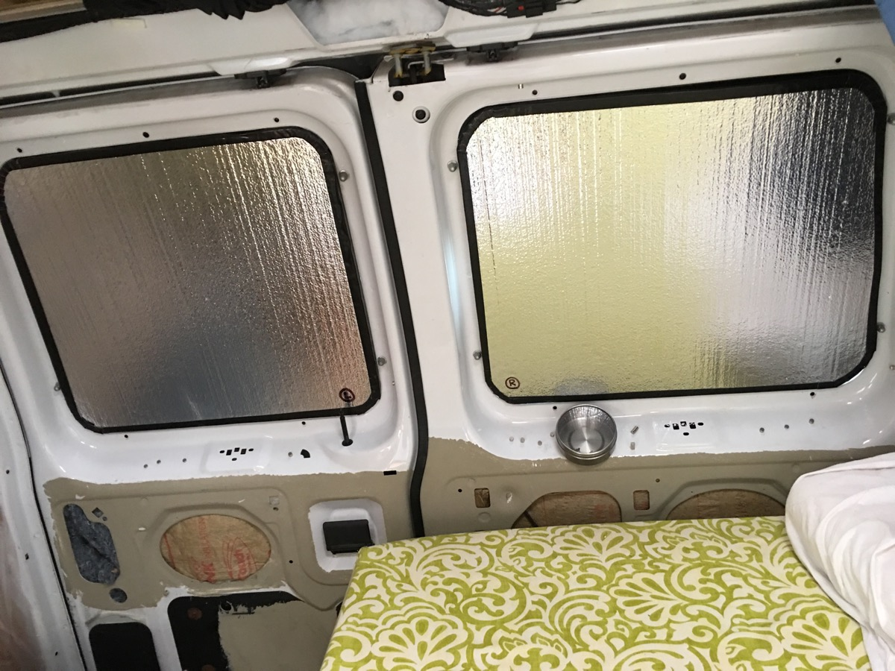

Curtains are ok, but they're a pain to set up and aren't very insulating. Here's how I built some window blocking insulating panels.

I plugged back in to the blog because it's been a few years. The van is still going strong at 180,000 miles.
I use it as a daily driver (although I live in the city now, so barely at all) and for camping trips.

Having a van makes it much easier to go camping when it's still chilly out, early in the year, and the national parks aren't busy. I'd say I get out a lot more because of it.

Anyway, this post is about privacy. You never know where you're going to park, so it's one of the first things you want to put in. I had curtains from walmart for a long time. They do solve the problem but they are a pain to tie up. They also have gaps where light can get out (so folks know you're camping) and creepers can peek in. You can use magnets to close all this up but it's a hassle.

I wanted a better solution, after looking around at what some other smart folks were doing, I made some window blocking panels.

The design was meant to be 2 sided. One side should reflect light back out for hot days, and the other side should be flat black for a discreet black-out effect when camping at night.

I got some thin rigid foam board at Home Depot that was already foil faced, so one side was already finished for my purposes.

I made a newspaper template of the windows. At this point I discovered the left and right rear window of a Ford e350 2006 are different sizes (!). This was a problem because I wanted them to just flip left and right to change from reflective to black-out. I ignored and proceeded anyway. The black-out side was more important to me to have a perfect fit.

I custom fit the foam to each window, then I wrapped the non-foil side with a black felt material. Used a little spray adhesive (3M General Adhesive 45) to keep it from sliding, trimmed the edges to fit exactly, and used black gorrilla tape to finish the edges:

This worked ok but the tape is already separating from the fabric a little bit. Probably look at a better adhesive between tape and fabric next time.

So what you end up with is a light rigid panel that's black on one side and shiny on the other:

The finished look is really nice, and the fit is by tension and very snug so far:

(Oh, labeling them because the windows are only slightly different)

From outside, it looks just like a dark tint. It's great:

Because the panels are rigid and the windows are curved, there are tiny gaps where light can escape at night. The best solution for a perfect fit would be a less rigid core (although that would be less insulating) for the panels and a piping that can fill up some empty space, like [these beautiful panels](http://roadtreklife.blogspot.com/2013/03/diy-reflectix-window-insulation.html) from @RoadTrekker. Maybe next time!

The different sizes worked out ok. You can see when I flip the sides to have the reflective side out, it doesn't fill the window, but that's ok:

